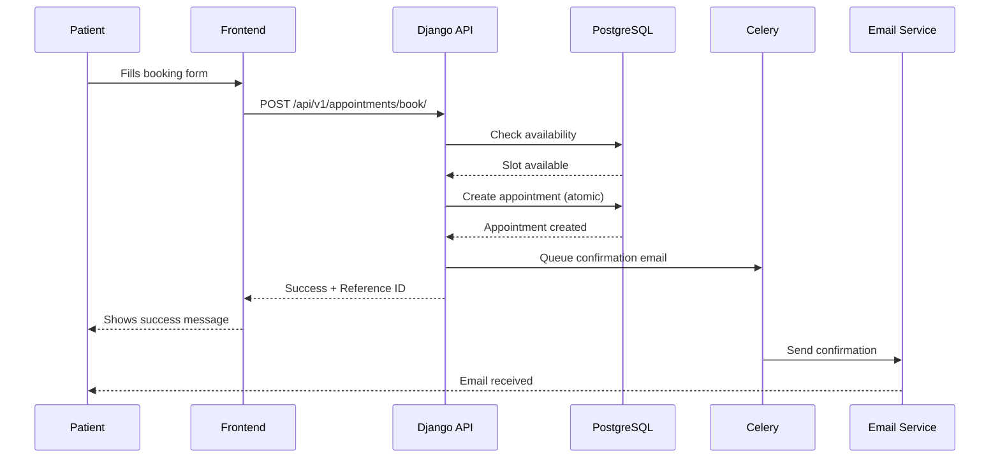
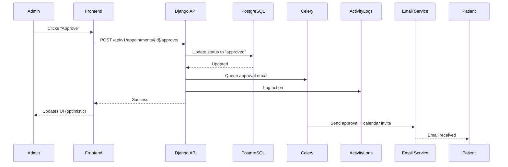

# 🏥 TZ Wellness Project - Complete Understanding

## 📖 What This Project Is

**TZ Wellness** is a **medical appointment booking platform** that allows:
- **Patients** to book appointments online without creating an account (guest checkout)
- **Admins** to manage appointments, approve/reject bookings, and view analytics
- **Visitors** to browse services, read blog posts, and register for events

---

## 🏗️ Current Architecture (BEFORE Migration)

### Tech Stack
```
┌─────────────────┐
│   FRONTEND      │
│   Next.js 14    │
│   (React)       │
└────────┬────────┘
         │
         │ HTTP REST API
         │ /api/v1/*
         ▼
┌─────────────────┐     ┌─────────────┐
│   BACKEND       │────▶│  PostgreSQL │
│   Django 5.0    │     │  Database   │
│   + DRF         │     └─────────────┘
└────────┬────────┘
         │
         ▼
┌─────────────────┐
│  Celery + Redis │
│  (Email Queue)  │
└─────────────────┘
```

### Components

#### 1. **Frontend (Next.js 14)**
- **Location**: `frontend/`
- **Framework**: Next.js 14 with App Router
- **UI**: Tailwind CSS + Shadcn/UI components
- **State**: TanStack Query (React Query) for API data
- **Pages**:
  - `/` - Homepage with featured services & blog
  - `/services` - Browse all medical services
  - `/book` - Multi-step booking wizard
  - `/appointments` - Look up appointment by reference ID
  - `/blog` - Read health articles
  - `/events` - Upcoming workshops and events
  - `/admin` - Admin dashboard (protected)

#### 2. **Backend (Django)**
- **Location**: `backend/`
- **Framework**: Django 5.0 + Django REST Framework
- **Database**: PostgreSQL (via Django ORM)
- **Apps**:
  - `appointments` - Core booking logic
  - `services` - Medical services catalog
  - `blog` - Content management
  - `events` - Workshop/event management
  - `users` - Admin authentication
  - `core` - Dashboard, utilities, middleware

#### 3. **Database (PostgreSQL)**
- **15 Tables**:
  - `appointments` - Booking records
  - `services` - Service catalog
  - `service_categories` - Service grouping
  - `weekly_availability` - Recurring time slots
  - `exception_dates` - Holidays/blocked dates
  - `blog_posts`, `blog_categories`, `blog_tags`
  - `events`, `event_categories`, `event_registrations`
  - `resources`, `resource_categories`
  - `users` - Admin accounts
  - `activity_logs` - Audit trail

#### 4. **Email System (Celery + Redis)**
- **Async task queue** for sending emails
- **Emails sent**:
  - Booking confirmation (guest receives)
  - Appointment approved (with calendar .ics file)
  - Appointment rejected (with reschedule link)
  - Event registration confirmation

---

## 🎯 Core Features

### 1. **Guest Booking (No Login Required)**

**Flow:**
```
Patient → Selects Service → Picks Date & Time → 
Fills Form (name, email, phone) → Submits →
Gets Reference ID (e.g., APT-ABC123XYZ) →
Receives Confirmation Email
```

**Key Points:**
- No account creation needed
- Rate limited: 5 bookings per hour per email
- Atomic transactions prevent double-booking
- Reference ID for tracking

### 2. **Real-Time Availability**

**Availability Engine:**
- Reads `weekly_availability` (Mon-Sun recurring slots)
- Checks `exception_dates` (holidays, blocked dates)
- Filters out already-booked slots from `appointments`
- Returns only truly available slots

**Example:**
```sql
-- Weekly: Monday 9 AM - 5 PM (8 slots)
-- Booked: 9 AM, 10 AM (2 slots)
-- Available: 11 AM, 12 PM, 1 PM, 2 PM, 3 PM, 4 PM (6 slots)
```

### 3. **Admin Dashboard**

**Features:**
- **Statistics**: Pending count, today's appointments, total patients, completion rate
- **Appointment Management**: View all, approve, reject, mark completed
- **Activity Logs**: Full audit trail of all actions
- **Charts**: Appointments by date (last 30 days)

**Workflow:**
```
Admin Logs In → Views Dashboard → 
Sees Pending Appointments → 
Clicks "Approve" → 
Patient Gets Email with Calendar Invite →
Appointment Status: PENDING → APPROVED
```

### 4. **Email Notifications**

**Sent by Celery workers:**
1. **Booking Confirmation** - When patient submits booking
2. **Approval Email** - When admin approves (includes .ics calendar file)
3. **Rejection Email** - When admin rejects (suggests rescheduling)
4. **Event Registration** - When user registers for event

### 5. **Multi-Modal Appointments**

**Modalities:**
- **Virtual** - Video call (link provided after approval)
- **In-Person** - Physical clinic visit
- **Phone** - Phone consultation

### 6. **Content Management**

**Blog System:**
- Categories, tags, authors
- SEO optimization (meta tags)
- View counting
- Featured posts

**Events System:**
- Workshops, webinars, support groups
- RSVP tracking
- Capacity management
- Virtual/in-person/hybrid

---

## 🔄 How Data Flows

### Example: Patient Books Appointment



### Example: Admin Approves Appointment



---

## 📁 Key Files Explained

### Frontend

| File | Purpose |
|------|---------|
| `src/lib/api.ts` | API client - all backend communication |
| `src/components/booking/` | Multi-step booking wizard |
| `src/app/admin/dashboard/` | Admin panel |
| `src/app/book/page.tsx` | Booking page entry point |
| `package.json` | Dependencies: Next.js, React Query, Tailwind |

### Backend

| File | Purpose |
|------|---------|
| `apps/appointments/models.py` | Appointment, Availability, Exception models |
| `apps/appointments/views.py` | Booking API endpoints |
| `apps/appointments/tasks.py` | Celery email tasks |
| `apps/appointments/availability.py` | Availability calculation engine |
| `apps/core/dashboard.py` | Admin dashboard statistics |
| `config/settings/base.py` | Django configuration |
| `requirements.txt` | Python dependencies |

---

## 🔐 Security Features

1. **Rate Limiting**
   - 5 bookings per hour per email (prevents spam)
   - Middleware: `apps.core.middleware.RateLimitMiddleware`

2. **Atomic Transactions**
   - All booking operations wrapped in `transaction.atomic()`
   - Prevents race conditions (double-booking)

3. **CORS Protection**
   - Only allows requests from frontend domain
   - Configured in `config/settings/base.py`

4. **Admin-Only Access**
   - Dashboard requires JWT authentication
   - Token stored in localStorage
   - Automatic token refresh on expiry

5. **Guest Checkout Validation**
   - Email format validation
   - Phone number validation
   - Reference ID uniqueness enforced

---

## 🎨 Design System

### Colors
- **Primary**: Deep Emerald `#064E3B` - Sidebar, headers
- **Action**: Terracotta `#E07A5F` - CTA buttons, links
- **Background**: Soft Sand `#F9F9F7` - Page background
- **Success**: Green - Confirmations
- **Warning**: Yellow - Pending status
- **Danger**: Red - Rejections, cancellations

### Components (Shadcn/UI)
- Buttons, Cards, Dialogs, Forms
- Calendar (date picker)
- Tabs, Accordions
- Toast notifications
- Loading spinners

---

## 📊 Database Schema Overview

### Core Tables

**Appointments**
```
id, reference_id, patient_name, patient_email, patient_phone
service_id, modality, scheduled_date, scheduled_time
status (pending/approved/rejected/completed/cancelled/no_show)
created_at, updated_at
```

**Services**
```
id, title, slug, category_id, description
modality (virtual/in_person/both)
duration_minutes, price
is_featured, is_published
```

**Weekly Availability**
```
id, day_of_week (0-6), start_time, end_time
is_active, allows_virtual, allows_in_person
```

**Exception Dates**
```
id, date, exception_type (blocked/modified)
reason, start_time, end_time (for modified hours)
```

---

## 🚀 Why Migrate to Supabase?

### Current Problems with Django

1. **Infrastructure Complexity**
   - Need 3 separate services: Django, PostgreSQL, Redis
   - Celery workers need monitoring
   - More things to break

2. **Deployment Costs**
   - Render: $7/month (Django)
   - Redis: $10/month
   - PostgreSQL: $7/month
   - **Total: $24+/month**

3. **Maintenance Burden**
   - Django security updates
   - Database migrations
   - Celery worker crashes
   - Redis memory management

4. **Development Speed**
   - Need to write API endpoints manually
   - Serializers, views, URLs for every feature
   - No automatic API documentation

### Benefits of Supabase

1. **All-in-One Platform**
   - Database (PostgreSQL)
   - Authentication (built-in)
   - Storage (for files)
   - Edge Functions (serverless)
   - Realtime (websockets)

2. **Zero Infrastructure**
   - No backend code to maintain
   - Auto-generated APIs
   - Automatic backups
   - Built-in monitoring

3. **Cost Savings**
   - Free tier: 500MB database, 50K MAU
   - Pro tier: $25/month (if you outgrow free)
   - **Save $24/month minimum**

4. **Better DX**
   - TypeScript types auto-generated from schema
   - Row Level Security (database-level permissions)
   - Real-time subscriptions out of the box
   - GraphQL auto-generated

5. **Scalability**
   - Serverless functions scale automatically
   - Database scales with your plan
   - No server capacity planning

---

## 📈 Feature Comparison

| Feature | Django Backend | Supabase |
|---------|---------------|----------|
| **Database** | PostgreSQL | PostgreSQL ✅ |
| **API** | Manual REST | Auto-generated ✅ |
| **Auth** | JWT + Custom | Built-in ✅ |
| **Email** | Celery + Redis | Edge Functions ✅ |
| **File Storage** | Local/S3 | Built-in Storage ✅ |
| **Real-time** | Manual WebSockets | Built-in ✅ |
| **Type Safety** | Manual types | Auto-generated ✅ |
| **Deployment** | 3 services | 1 service ✅ |
| **Cost** | $24+/month | $0-25/month ✅ |
| **Maintenance** | High | Low ✅ |

---

## 🎯 Migration Impact

### What Changes

1. **Backend Code** - ❌ Completely removed
2. **Frontend API Calls** - ✅ Updated (but interface stays same)
3. **Database Schema** - ✅ Migrated to Supabase
4. **Email System** - ✅ Edge Functions + Resend
5. **Admin Auth** - ✅ Supabase Auth

### What Stays the Same

1. **User Experience** - 100% identical
2. **Features** - All preserved
3. **UI/Design** - No changes
4. **Frontend Code** - Components untouched (only API layer changes)
5. **Database Structure** - Same tables, relationships

---

## 🛠️ Migration Strategy Summary

### 4-Day Plan

**Day 1: Setup**
- Create Supabase project
- Run database schema migration
- Setup Edge Functions

**Day 2: Frontend**
- Install Supabase client
- Replace API calls
- Test all features

**Day 3: Authentication & Testing**
- Setup admin auth
- Comprehensive testing
- Fix any bugs

**Day 4: Cleanup & Deploy**
- Remove Django backend
- Deploy to Vercel
- Production testing

---

## 📚 Documentation You Have

1. **`SUPABASE_MIGRATION_GUIDE.md`** - Comprehensive migration guide (78KB)
2. **`MIGRATION_CHECKLIST.md`** - Step-by-step checklist (this file)
3. **`README.md`** - Current project documentation
4. **`IMPLEMENTATION_SUMMARY.md`** - What's already built

---

## 🎯 Next Steps

1. **Read the migration guide** (`SUPABASE_MIGRATION_GUIDE.md`)
2. **Follow the checklist** (`MIGRATION_CHECKLIST.md`)
3. **Test each phase** before moving to next
4. **Ask questions** if you get stuck

---

## 💡 Key Concepts to Understand

### 1. **Guest Checkout**
No user accounts for patients - only reference ID for tracking

### 2. **Availability Engine**
Complex logic to calculate which time slots are bookable

### 3. **Atomic Transactions**
Database operations that must all succeed or all fail (prevents double-booking)

### 4. **Optimistic UI**
Frontend updates immediately before server responds (feels instant)

### 5. **Row Level Security (RLS)**
Database-level permissions (Supabase feature) - more secure than app-level

### 6. **Edge Functions**
Serverless functions that run code without managing servers

### 7. **Service Role vs Anon Key**
- **Anon key**: Public, used by frontend (restricted by RLS)
- **Service role**: Secret, bypasses RLS (admin operations)

---

## 🎉 You're Ready!

You now understand:
- ✅ What the project does
- ✅ How it's built (current architecture)
- ✅ Why you're migrating (benefits)
- ✅ What will change (and what won't)
- ✅ How to migrate (step-by-step guide)

**Start with**: `MIGRATION_CHECKLIST.md` Phase 1!
